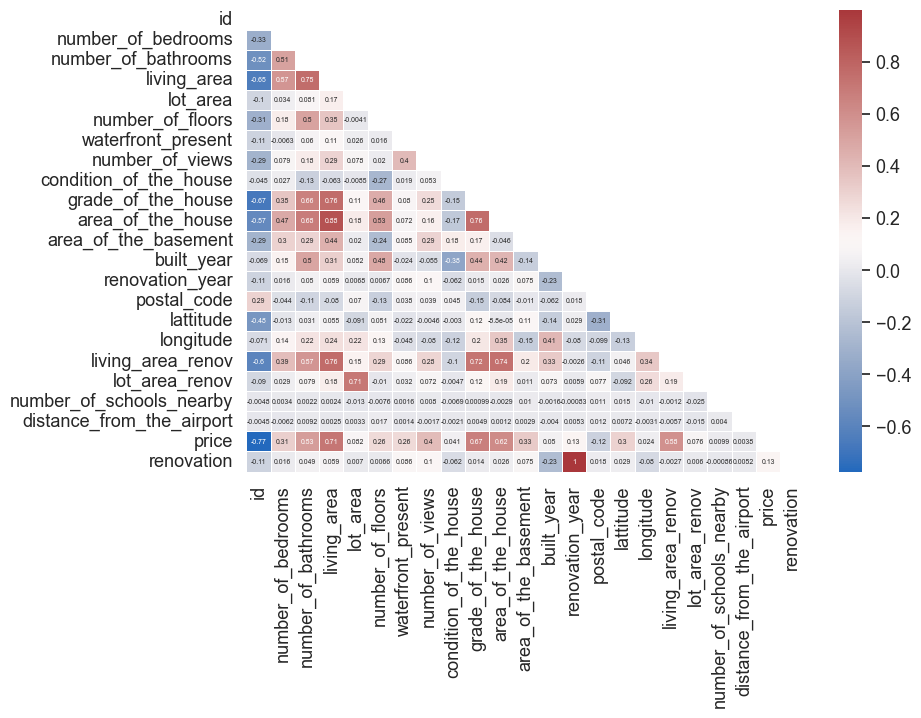
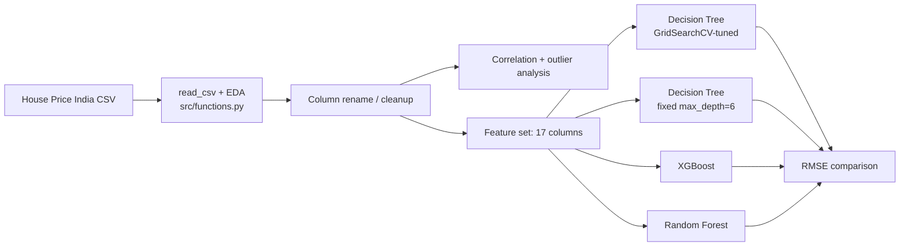

# House Price Prediction (India)

Compares a tuned decision tree, a fixed-depth decision tree, XGBoost, and Random Forest on ~14,600 Indian home sales, for anyone benchmarking tree-based regressors against each other on the same real-estate dataset.


## Demo


*Correlation heatmap across all 23 raw features, from the notebook's EDA pass.*

## Problem → Solution

Home price is driven by a mix of physical attributes (bedrooms, living area, lot size) and location/condition factors (grade, distance from airport, nearby schools) that don't interact linearly. This notebook works through EDA on a ~14,600-row Indian housing dataset, then benchmarks four tree-based regressors — a grid-search-tuned decision tree, a fixed-depth decision tree, XGBoost, and Random Forest — against each other on the same feature set and target (`price`).

## Key features

- EDA on 23 raw housing features (bedrooms, bathrooms, living/lot area, floors, waterfront, grade, condition, renovation history, school proximity, airport distance)
- Correlation heatmap and price distribution/outlier analysis across the full feature set
- Four regressors compared on the same features/target: `GridSearchCV`-tuned decision tree, fixed-`max_depth` decision tree, XGBoost, and Random Forest
- Renovation-year and built-year derived features (age since renovation, renovation flag) tested against price trends
- A reconstructed [`src/functions.py`](src/functions.py) helper module, written from the notebook's own saved outputs, so the notebook actually runs end-to-end

## Tech stack

- **pandas / numpy** — feature cleaning and column renaming on the raw CSV
- **scikit-learn** — `GridSearchCV` for decision-tree hyperparameter search
- **XGBoost** — gradient-boosted tree baseline compared against the decision trees
- **seaborn / matplotlib** — EDA plots (correlation heatmap, histograms, boxplots, scatter/line trend plots, decision-tree diagram)

## Architecture



## Quickstart

The original helper module (`functions.py`) was maintained on a teammate's personal machine during the original team assignment and was never part of this notebook's folder — it isn't recoverable. [`src/functions.py`](src/functions.py) is a from-scratch reimplementation, written by inspecting the notebook's own saved outputs (printed metrics, tuple shapes, column names), not the original source. It makes the notebook runnable, but re-running it **will not necessarily reproduce the exact numbers already saved in the notebook** — the original `GridSearchCV` parameter grids and scoring setup aren't fully recoverable from printed output alone. The Results table below reports the original saved numbers, not numbers from this reconstruction.

```bash
git clone https://github.com/prajithkdev/house-price-prediction-india.git
cd house-price-prediction-india
python -m venv .venv
source .venv/bin/activate   # Windows: .venv\Scripts\activate
pip install -r requirements.txt
jupyter notebook notebooks/house_price_analysis.ipynb
```

## How it works

**Four regressors, one feature set, compared head-to-head.** Rather than picking one algorithm, the notebook runs a grid-search-tuned decision tree, a manually fixed-depth decision tree, XGBoost, and Random Forest against the identical 17-feature set and target — making the RMSE comparison below a fair like-for-like comparison rather than four separately-tuned pipelines.

**The tuned single tree was still the weakest model.** The grid-search decision tree (chosen via `GridSearchCV` on `max_depth`/`min_samples_split`) had the highest (worst) RMSE of the four — ensembles (Random Forest, XGBoost) beat both single trees, which is the expected, unsurprising result for tabular data like this. Separately, the original tuning cell also prints a `"Best RMSE score: 0.6356"` that is almost certainly the grid search's internal R² or a normalized scoring metric, not a dollar-scale RMSE — it's reported as-is in the Results table below since the exact original scoring setup couldn't be recovered, but it shouldn't be read as a second RMSE figure.

## Results / impact

RMSE (lower is better) on `price`, as recorded in the original notebook run — verified directly against each model cell's own output, not assumed from cell order:

| Model | RMSE |
|---|---|
| Decision Tree (`GridSearchCV`-tuned: `max_depth=6`, `min_samples_split=2`) | 228,758 |
| XGBoost | 197,263 |
| Random Forest | **192,692** (best) |
| Decision Tree (fixed `max_depth=6`) | not printed — this cell only renders a tree-structure plot, no RMSE |

## What I'd do next

- Add a real RMSE for the fixed-depth decision tree (currently only a plot) so all four models are numerically comparable.
- Confirm what the original tuning cell's "Best RMSE score: 0.6356" actually measured — almost certainly R² given the 0–1 range, but the original scoring setup wasn't recoverable to confirm it.
- Run the reconstructed `src/functions.py` end-to-end and compare its numbers against the originally-saved ones, to see how close a from-scratch reimplementation gets.
- Use `lattitude`/`longitude` for an actual map visualization (e.g., price by geographic cluster) — the dataset has the fields for it.

## Background

Developed as a team project for a data-mining coursework assignment (ALY6040) at Northeastern University.
